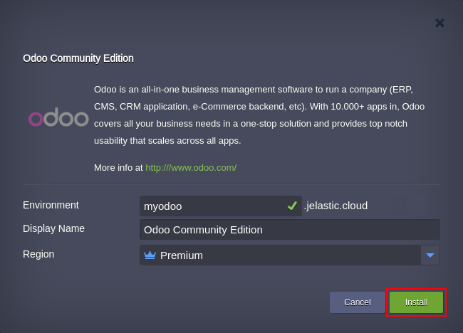
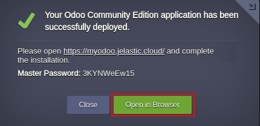

 

# Odoo
Odoo is the world's most popular all-in-one EPR and CRM open platform for business applications.

### Highlights
This package is designed to deploy Odoo environment which represents an open system for business automation written in Python. 

### Deployment

In order to get *Odoo* instantly deployed, click the **Deploy to Jelastic** button below and specify your email address within the opened widget. Then choose one of the [Jelastic Public Cloud](https://jelastic.cloud) providers (in case you don’t have an account at the appropriate platform, it will be created automatically) and press **Install**.

To install the package manually, log in to the Jelastic dashboard with your credentials and [import](https://docs.jelastic.com/environment-import) link to the [*_manifest.jps_*](https://raw.githubusercontent.com/jelastic-jps/odoo/master/manifest.jps) file.

Within the opened installation window, type *Environment* name and optional *Display Name* ([*environment alias*](https://docs.jelastic.com/environment-aliases)). Also, select the preferable [*Region*](https://docs.jelastic.com/environment-regions) (if several ones are available) and click **Install**.

Wait a few minutes for Jelastic to prepare your environment and set up system. When finished, you’ll be shown the appropriate notification with Admin panel access credentials. Press **Open in Browser** button to make sure that application is up and running. 

This information will be also duplicated to you via email.
